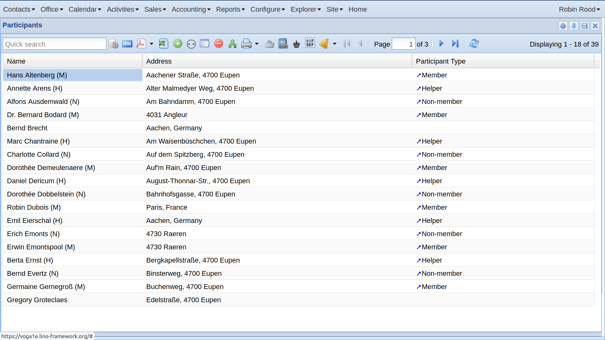

.. doctest docs/userman/tour.rst
.. include:: /../docs/shared/include/defs.rst
.. _voga.tour:

==============================
An introduction to Lino Voga
==============================

How to create new participants
==============================

Click on the :guilabel:`[Participants]` quick link in the dashboard.
Lino shows a list of existing participants.

- In the quick search field, type some part of the participant's name in order
  to verify that Lino doesn't yet have it.

- Click on |insert| button in the toolbar.  Fill in the fields of the dialog
  window.

- Click :guilabel:`Create` or hit :kbd:`Ctrl+S` to store the data in the
  database.  Lino shows the newly created participant in a :term:`detail window`
  where you can continue to enter more information about them.

.. image:: new_particiant_detail.png

Before enrolling the participant into an activity, we must create at least one.

Create your first activity
==========================

- In the main menu, select :menuselection:`Configure --> Calendar --> Rooms` and
  create a room.  This step is optional. If you don't want Lino to care about
  rooms, you can leave the rooms of your activities blank.

- In the main menu, select :menuselection:`Activities --> Activity lines` and
  create an activity line "Ceramics workshop".

  In the detail window of your activity line, set "Manage presences as:" to
  "Participant".

- In the main menu, select :menuselection:`Activities --> Activities` and create
  an activity "Ceramics workshop 2021".  Choose some existing person as
  instructor.  You can also leave that field blank and dill it later.

- In the detail window of your activity

Issuing invoices
================

- :class:`lino_xl.lib.sales.InvoicesToCreate`
